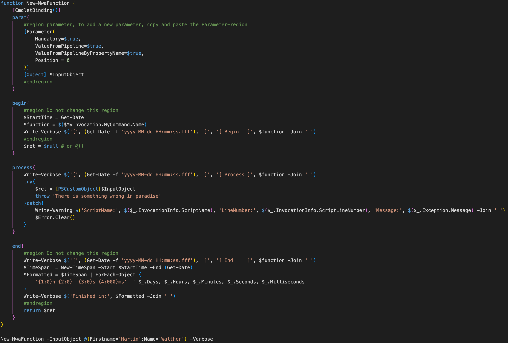

# VSCode
My Visual Studio Code samples

## Snippets

### New-MwaFunction

Every time you need a new function in Visual Studio Code, enter mwa + tab, and you get a new function from my snippet:

### New snippet

To create your own snippet or to add my snippet, select Manage, User Snippets (Ctrl. + Shift + P) > Preferences > Configure User Snippets > PowerShell

Copy the content from Data/user-data/User/snippets/powershell.json to the new snippet.
